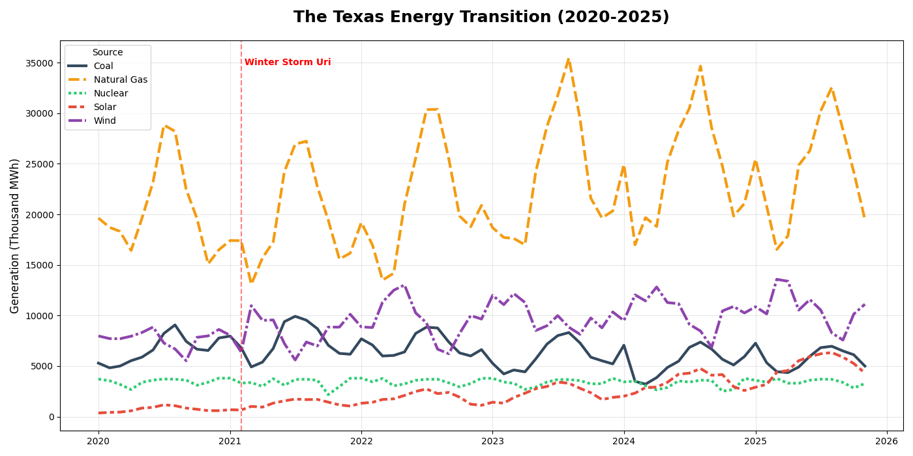

# ⚡ The Texas Energy Transition (2020-2025)

An automated data pipeline and visualization tool that tracks electricity generation trends in Texas (ERCOT) using the U.S. Energy Information Administration (EIA) API.



## 📋 Project Overview
This project fetches, cleans, and visualizes 5 years of monthly power generation data (over 50,000 data points) to analyze how the Texas grid is evolving. It specifically highlights the interplay between **Natural Gas**, **Wind**, **Solar**, and **Nuclear** energy sources.

### Key Questions Answered:
* How did the grid respond during **Winter Storm Uri** (Feb 2021)?
* Is **Solar** energy actually making a dent in the grid mix?
* How do **Wind** and **Natural Gas** complement each other during peak summer heat?

## 💡 Key Findings
1.  **The Solar Explosion:** Solar generation has grown **18x** since Jan 2020, rising from a niche 354 GWh to over 6,300 GWh per month.
2.  **Gas vs. Wind Inverse:** There is a strong negative correlation between Wind and Gas. When Wind generation dips in late summer (August), Natural Gas ramps up aggressively to meet peak A/C demand.
3.  **Nuclear Stability:** Nuclear power remains the grid's "flat line," providing a consistent ~3.6M MWh baseload, only dipping during scheduled maintenance in shoulder months (April/October).

## 🛠️ Tech Stack
* **Python 3.x**
* **Pandas:** Data manipulation and time-series analysis.
* **Seaborn & Matplotlib:** Advanced data visualization.
* **Requests:** API data fetching.
* **EIA API:** Source of truth for energy data.

## 🚀 How to Run

### 1. Prerequisites
You will need a free API key from the [EIA Open Data](https://www.eia.gov/opendata/).

### 2. Installation
```bash
# Clone the repository
git clone [https://github.com/YOUR_USERNAME/texas-energy-transition.git](https://github.com/YOUR_USERNAME/texas-energy-transition.git)

# Install required packages
pip install pandas matplotlib seaborn requests
